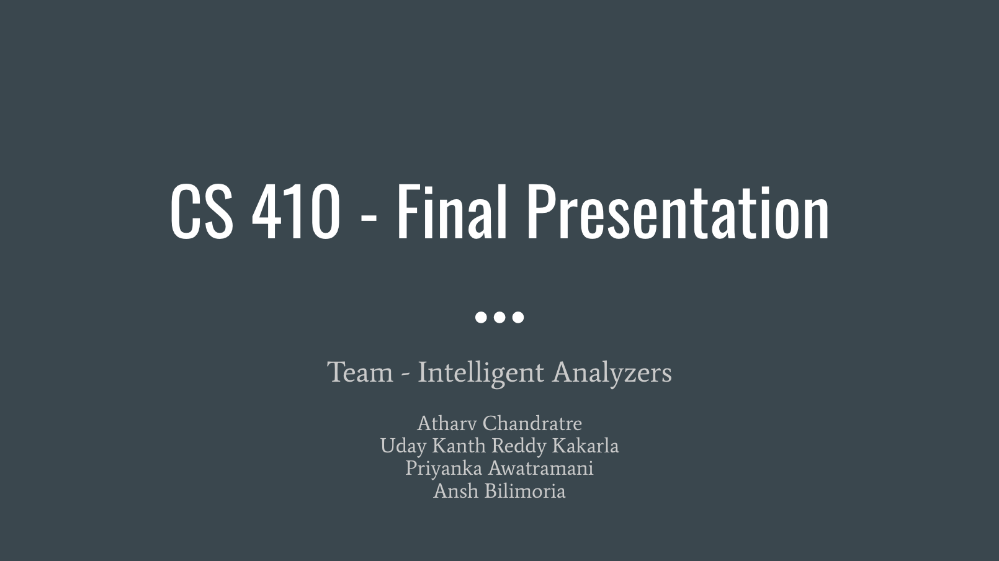

# Company Perception Tool Using Sentiment Analysis

## Team Name - Intelligent Analyzers
Team Members:
- Atharv Chandratre - atharvc2@illinois.edu (Captain) 
- Uday Kanth Reddy Kakarla - uk3@illinois.edu
- Priyanka Awatramani - pma7@illinois.edu
- Ansh Bilimoria - amb20@illinois.edu

## Demo Video

Click on the image below to go to the demo video.

### Note - Documentation is in the Documentation.pdf file in the root directory.

## How to use the code
Required software:
- Python 3

Run this to install the dependencies:

    pip install webdriver-manager selenium lzma numpy pandas nltk scikit-learn textblob statistics

### Scraper Usage
1.  Change the configuration variables which govern the number of companies the scraper will scrape for, and the number of reviews for each company which the scraper will extract. This can be found in the third cell of the Jupyter Notebook.  
    Note - do not set the number of reviews to scrape per company to over 150. Otherwise, indeed.com will block the scraper (by blocking your IP address for a cooldown period).
2.  Run all the cells in the Jupyter Notebook ([Web Scraper.ipynb](https://github.com/AtharvChandratre/CourseProject/blob/main/code/Web%20Scraper.ipynb "Web Scraper.ipynb")). There should be a run all cells button at the top of the IDE.
3.  Once all the cells have run, it will create your requested dataset in the present working directory.

### Sentiment Analyzer Usage
1.  You might also need to install some other required packages that are mentioned in the .ipynb file. The first block of the python notebook will contain the install script for them.
2.  After all dependencies are correctly installed, run every block of the Python notebook for both the lexicon-based ([Sentiment Analysis using Textblob with PreProcessing.ipynb](https://github.com/AtharvChandratre/CourseProject/blob/main/code/Sentiment%20Analysis%20using%20Textblob%20with%20PreProcessing.ipynb "Sentiment Analysis using Textblob with PreProcessing.ipynb")) as well as the machine learning models ([ML_Based_Approach.ipynb](https://github.com/AtharvChandratre/CourseProject/blob/main/code/ML_Based_Approach.ipynb "ML_Based_Approach.ipynb")). You can also run all the cells at once by clicking on the run all button.

### Recommendation System Usage
1.  For running the web application which includes the recommendation system please install the [Live-Server extension in VS code](https://marketplace.visualstudio.com/items?itemName=ritwickdey.LiveServer). This is demonstrated in the video. If you are using live-server, once you install the extension and open [app.js](https://github.com/AtharvChandratre/CourseProject/blob/main/app.js "app.js") as shown in the demo, you will have an option which says to “Go Live” at the bottom right of your VS code editor.
    
2.  Once you click Go Live the application is deployed and you can enter the name of the company of which you want to find the Sentiment score, label and the recommendation for that company.

## Idea Description

Sentiment analysis (or opinion mining) is a natural language processing (NLP) technique used to determine whether data is positive, negative, or neutral. Sentiment analysis is often performed on textual data to help businesses monitor brand and product sentiment in customer feedback, and understand customer needs. We scrape the company reviews’ data using our written scraper and then pre-process the data to tokenize the data and remove unnecessary tokens like stop words, punctuations, etc. We use NLTK (Natural Language Toolkit), a Python-based Natural Language Processing library for these tasks. We then use sentiment analysis on this data to help estimate employee satisfaction. We are using ‘emotion detection’ sentiment analysis, allowing us to go beyond polarity (i.e. very positive, positive, neutral, negative, very negative), to detect emotions, like happiness, frustration, anger, and sadness. Many emotion detection systems use lexicons (i.e. lists of words and the emotions they convey) or complex machine learning algorithms. We would be using the lexicon-based approach. We even developed a UI where a user can input a company name and we provide the score, positive/negative sentiment, and some recommendations on how to improve that satisfaction score.
